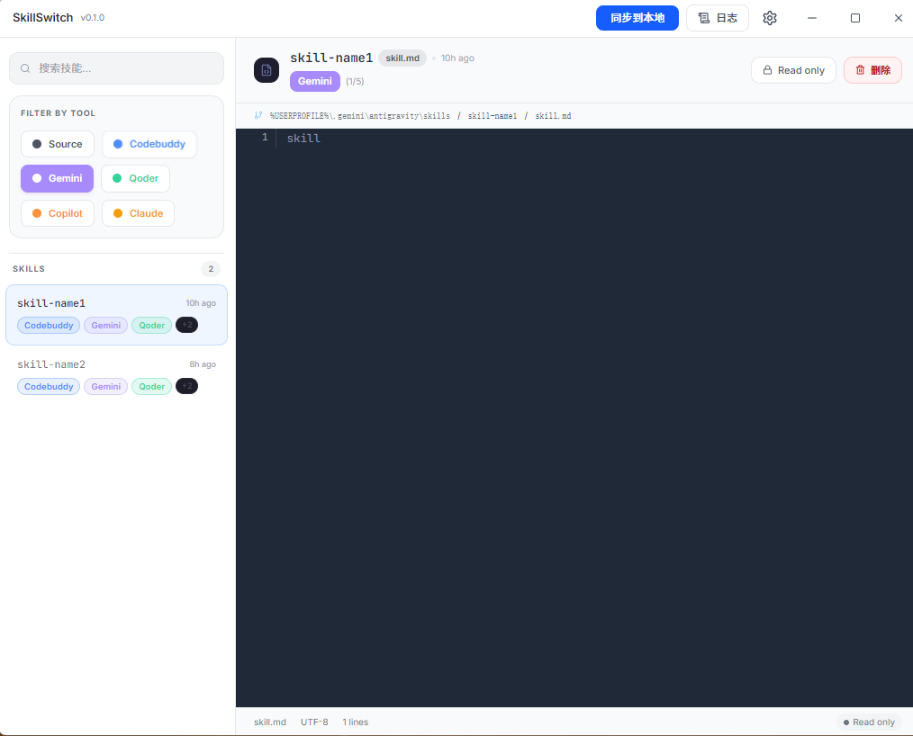
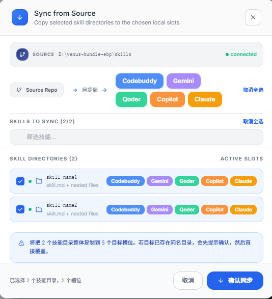

# SkillSwitch

SkillSwitch 是一个基于 Electron + React + Vite 的 Windows 桌面工具，用来浏览源技能目录中的 `skill.md`，并将完整技能目录同步到多个本地目标槽位。
<div align="center">
  
</div>
<div align="center">
  
</div>
## 主要能力

- 浏览源目录下第一层技能目录
- 只读预览每个技能目录中的 `skill.md`
- 同步整个技能目录到多个本地槽位
- 支持覆盖保护、同步回滚、操作日志
- 支持系统托盘和关闭最小化到托盘

## 环境要求

- Windows 10 / 11
- Node.js 20+
- npm 10+

在 PowerShell 中建议使用 `npm.cmd`，避免部分环境下 `npm` 解析异常。

## 开发运行

安装依赖：

```powershell
npm.cmd install
```

启动开发环境：

```powershell
npm.cmd run dev
```

常用命令：

```powershell
npm.cmd run build
npm.cmd run test:unit
npm.cmd run test:integration
npm.cmd run test:acceptance
npm.cmd run test:e2e
npm.cmd test
```

说明：

- `build`：编译 renderer 和 Electron 主进程
- `test:unit`：运行服务层单元测试
- `test:integration`：运行 IPC 集成测试
- `test:acceptance`：运行验收脚本
- `test:e2e`：运行 Electron 端到端测试
- `test`：执行完整回归

## 生成 EXE

默认分发命令：

```powershell
npm.cmd run electron:dist
```

当前默认产物为绿色免安装单文件 EXE，文件名格式：

```text
SkillSwitch-<version>-win-x64-portable.exe
```

实际输出目录：

```text
release/
```

当前也保留了可选安装器命令：

```powershell
npm.cmd run electron:dist:nsis
```
